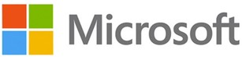

# **Hello and Welcome!**

### I'm currently learning:
* How to use Git and Github
* HTML and CSS basics
* Programming best practices

### I enjoy:
* Creative projects - **Coding is creative!**
* Tabletop RPGs
* PC gaming

### I have basic knowledge of:
* Git
* HTML & CSS

# Professional

### Data Center Technician at Microsoft
Currently apprenticing in Software Engineering in _Microsoft Leap Internal Program_

