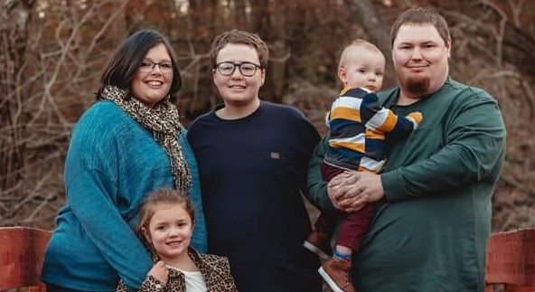

# **Hello and Welcome!**

### I'm currently learning:
* How to use Git and Github
* Web development with HTML, CSS, JavaScript, React
* C#
* Programming best practices

### I enjoy:
* Creative projects
* Problem Solving
* Tabletop RPGs
* PC gaming

### I have a basic knowledge of:
* Git
* HTML & CSS
* C#
* SQL
* JavaScript & React

### Contact me
* [Email](mailto:tabatson@gmail.com)
* [LinkedIn](https://www.linkedin.com/in/t-a-batson/)

# Professional
Software Engineering apprentice in _Microsoft Leap Internal Program_

